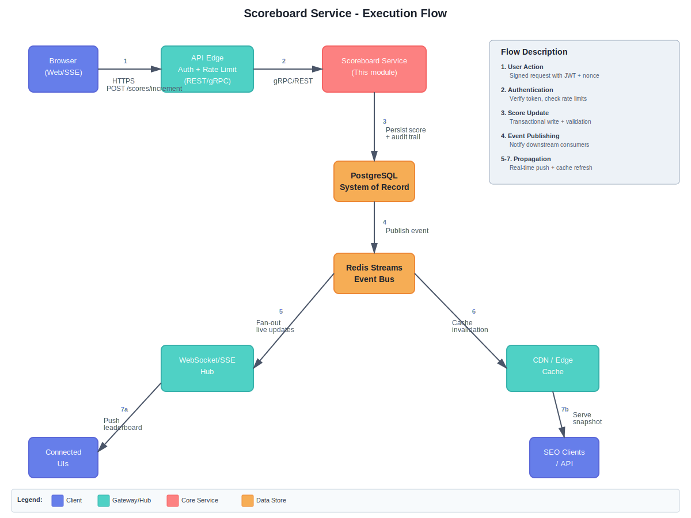

# Problem 6 - Live Scoreboard Module Specification

## 1. Module purpose
Build a backend module named **Scoreboard Service** responsible for updating user scores and streaming the top-10 leaderboard to clients in real time.

## 2. Functional scope
- Receive score increment requests from authenticated clients.
- Persist user scores and compute the canonical top-10 list.
- Broadcast changes to connected clients with sub-second latency.
- Provide audit logs for moderation and fraud analysis.

## 3. Interfaces
### 3.1 HTTP endpoints
| Method | Path | Description |
| ------ | ---- | ----------- |
| `POST` | `/scores/increment` | Increment an authenticated user's score. Body: `{ "delta": number, "nonce": string }`. |
| `GET` | `/scores/top` | Returns the current top-10 snapshot for SEO / non-realtime clients. |
| `GET` | `/scores/stream` | Server-Sent Event (SSE) endpoint streaming leaderboard updates. |

### 3.2 Internal events
- `score.updated` - published after a score increment is committed; carries `{ userId, totalScore, updatedAt }`.
- `leaderboard.updated` - published when the top-10 ordering changes; contains the whole list for cache invalidation.

## 4. Data model
```
UserScore {
  userId: string;
  total: number;
  updatedAt: Date;
  version: number; // optimistic concurrency guard
}

ScoreAuditLog {
  id: string;
  userId: string;
  delta: number;
  previousTotal: number;
  newTotal: number;
  ipHash: string;
  issuedAt: Date;
  signatureValid: boolean;
}
```
A sorted-set (Redis) mirrors the user totals for fast rank queries, while PostgreSQL is the system of record.

## 5. Execution flow



### Step-by-step breakdown
1. Browser posts a signed increment request.
2. API edge forwards the verified request to the Scoreboard Service via gRPC/REST.
3. Service validates business rules, persists the new total in PostgreSQL (transactional), and writes an audit trail.
4. Changes are published to Redis Streams for downstream processing.
5. Stream consumer pushes updates to WebSocket/SSE hub for live clients.
6. Cache invalidation workers refresh the `/scores/top` snapshot in CDN/edge cache.
7. Clients receive the updated leaderboard via SSE/WebSocket or REST.

## 6. Security & anti-abuse
- **Authentication**: Require JWT access tokens issued by the auth service. Include `userId`, `sessionId`, and expiry.
- **Action signature**: Frontend signs the payload using an ephemeral key derived from the session to prevent replay. Nonce stored and checked server-side.
- **Rate limiting**: Enforce per-user and per-IP quotas (e.g., sliding window via Redis). Suspicious bursts trigger moderation flags.
- **Server validation**: Reject negative or oversized deltas; cap maximum per action and per minute.
- **Audit trail**: Every increment stored with hashed IP and signature validity for retroactive analysis.

## 7. Observability
- Emit structured logs for increments, fraud denials, and leaderboard recomputations.
- Metrics: `score_increment_latency`, `leaderboard_refresh_time`, `active_stream_connections`, `fraud_block_count`.
- Alerts when latency > 500 ms or fraud blocks spike.

## 8. Operational considerations
- Leaderboard recomputation occurs only when a new total enters or leaves top-10; use Redis sorted-set rank operations.
- Implement backpressure handling on SSE hub (heartbeat + reconnect tokens).
- Offer blue/green deploy hooks to drain SSE connections gracefully.

## 9. Suggested future improvements
- Replace SSE with WebSocket multiplexing plus delta compression once traffic scales.
- Introduce machine-learning scoring on the audit log to auto-ban abusive sessions.
- Add international shards (per region leaderboards) behind the same API shape.
- Consider migrating Redis Streams to Kafka for multi-region durability when required.
